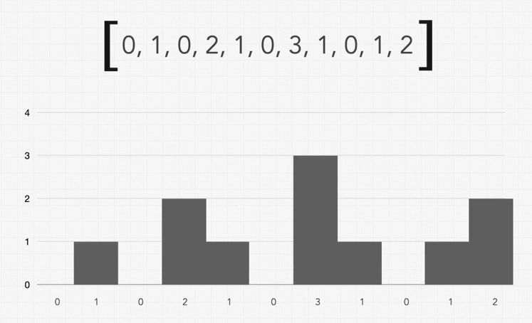
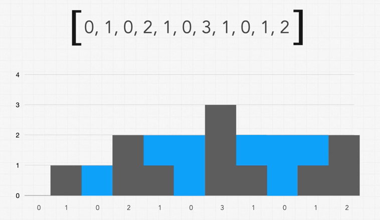
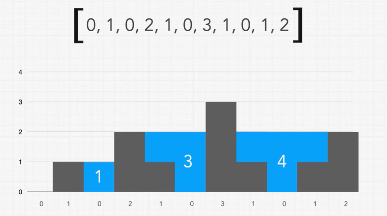

Given an array of integers representing an elevation map where the width of each bar is 1, return how much water can be trapped.

Eg, input elevation map: [0, 1, 0, 2, 1, 0, 3, 1, 0, 1, 2]

Expected output: Trapped rainwater is represented in BLUE color below: 

So here the total trapped water calculation is: 

    [0, 0, 1, 0, 1, 2, 0, 1, 2, 1, 0]
    = adding these 
    = [1] + [1 + 2] + [1 + 2 + 1]
    = 8  
